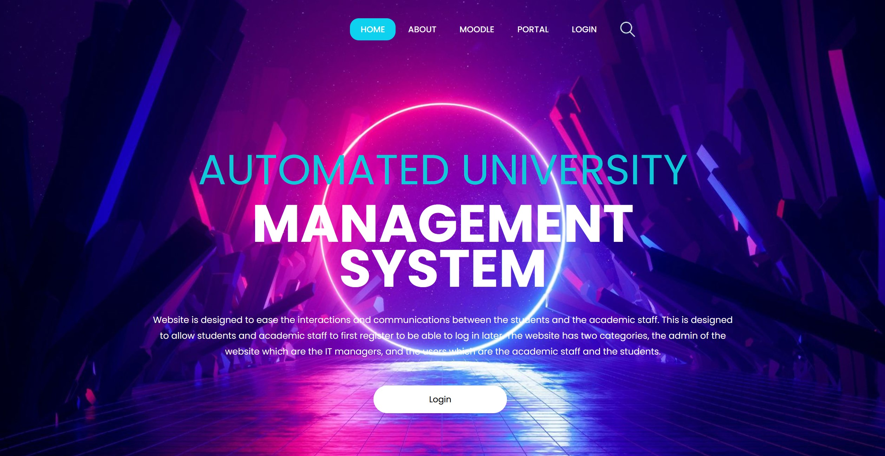

# Automated University Management System

A comprehensive web-based university management system built with PHP, MySQL, HTML, and CSS. This system streamlines university operations including student authentication, course registration, schedule management, and administrative tasks.


*University Management System Dashboard*

## 🌟 Features

### Student Portal
- **Secure Authentication**: Login system with session management and activity logging
- **Course Registration**: Browse available courses and register for classes
- **Schedule Management**: View and manage registered courses
- **Real-time Seat Availability**: Check course capacity before registration
- **Course Dropping**: Drop registered courses with automatic seat count updates

### Security Features
- **SQL Injection Protection**: Uses prepared statements for all database queries
- **Session Management**: Secure user sessions with proper authentication
- **Activity Logging**: Comprehensive logging of all user actions with IP tracking
- **Input Validation**: Server-side validation for all user inputs
- **Transaction Support**: Database transactions ensure data consistency

### Administrative Features
- **User Management**: Track student registrations and activities
- **Course Management**: Manage course offerings and seat availability
- **Activity Logs**: Monitor system usage and security events
- **Database Integration**: Centralized database for all university data

## 📸 Screenshots


*Dashboard View*

<!-- Feature specific screenshots available upon deployment -->

## 🚀 Getting Started

### Prerequisites

- **Web Server**: Apache (XAMPP, WAMP, or LAMP)
- **PHP**: Version 7.4 or higher
- **MySQL**: Version 5.7 or higher
- **Browser**: Modern web browser (Chrome, Firefox, Edge, Safari)

### Installation

1. **Clone the repository**
   ```bash
   git clone <your-repo-url>
   cd Automated-University-Management-System
   ```

2. **Set up the database**
   - Start your MySQL server (via XAMPP/WAMP control panel)
   - Create a new database named `powercampus`
   - Import the database schema:
     ```sql
     mysql -u root -p powercampus < database.sql
     ```
   - Or use phpMyAdmin to import the SQL file

3. **Configure database connection**
   - Open `database.php`
   - Update database credentials if needed:
     ```php
     define('DB_HOST', 'localhost');
     define('DB_USER', 'root');
     define('DB_PASS', '');
     define('DB_NAME', 'powercampus');
     ```

4. **Deploy to web server**
   - Copy project files to your web server directory:
     - XAMPP: `C:\xampp\htdocs\university-system\`
     - WAMP: `C:\wamp64\www\university-system\`
     - LAMP: `/var/www/html/university-system/`

5. **Set permissions** (Linux/Mac)
   ```bash
   chmod 755 -R /var/www/html/university-system/
   chmod 777 -R /var/www/html/university-system/log/
   ```

6. **Access the application**
   - Open your browser and navigate to:
     ```
     http://localhost/university-system/
     ```

## 📖 Usage Guide

### For Students

1. **Login**
   - Navigate to the login page
   - Enter your email and password
   - Click "Login" to access your dashboard

2. **Register for Courses**
   - Browse available courses in the course catalog
   - Check seat availability
   - Select courses and click "Register"
   - Confirm your registration

3. **View Schedule**
   - Access your dashboard to see registered courses
   - View course details, times, and locations

4. **Drop Courses**
   - Navigate to your registered courses
   - Select courses to drop
   - Confirm the drop action

### For Administrators

- Access the admin panel to manage users and courses
- View activity logs for security monitoring
- Update course information and seat availability

## 🗄️ Database Schema

### Users Table
```sql
CREATE TABLE users (
    id INT PRIMARY KEY AUTO_INCREMENT,
    Email VARCHAR(255) UNIQUE NOT NULL,
    Password VARCHAR(255) NOT NULL,
    Name VARCHAR(255),
    Registered_Courses TEXT,
    created_at TIMESTAMP DEFAULT CURRENT_TIMESTAMP
);
```

### Courses Table
```sql
CREATE TABLE coursesData (
    id INT PRIMARY KEY AUTO_INCREMENT,
    courseName VARCHAR(255) UNIQUE NOT NULL,
    Seats INT DEFAULT 0,
    instructor VARCHAR(255),
    schedule VARCHAR(255),
    created_at TIMESTAMP DEFAULT CURRENT_TIMESTAMP
);
```

## 🛠️ Technology Stack

- **Frontend**:
  - HTML5
  - CSS3
  - Bootstrap 4
  - JavaScript

- **Backend**:
  - PHP 7.4+
  - MySQL 5.7+

- **Security**:
  - Prepared Statements (SQL Injection Prevention)
  - Session Management
  - Input Validation
  - Activity Logging

## 📁 Project Structure

```
Automated-University-Management-System/
├── index.html              # Homepage
├── login.php               # Login page and authentication
├── database.php            # Database operations (secure)
├── about.html              # About page
├── css/                    # Stylesheets
│   ├── bootstrap.min.css
│   └── style.css
├── images/                 # Image assets
├── main/                   # Main application pages
│   └── index.php          # Student dashboard
├── schedule/              # Schedule management
├── log/                   # Activity logs (auto-created)
└── README.md              # This file
```

## 🔒 Security Best Practices

This system implements several security measures:

1. **Prepared Statements**: All SQL queries use prepared statements to prevent SQL injection
2. **Session Security**: Proper session management with secure session handling
3. **Input Validation**: All user inputs are validated and sanitized
4. **Error Logging**: Errors are logged securely without exposing sensitive information
5. **Activity Monitoring**: All user actions are logged with timestamps and IP addresses
6. **Transaction Support**: Database transactions ensure data integrity

## 🔧 Configuration

### Database Configuration
Edit `database.php` to change database settings:
```php
define('DB_HOST', 'localhost');
define('DB_USER', 'your_username');
define('DB_PASS', 'your_password');
define('DB_NAME', 'powercampus');
```

### Logging
Logs are automatically created in the `log/` directory with the format:
- Filename: `log[day].[month].[year].log`
- Contains: IP address, timestamp, action, and user email

## 🐛 Troubleshooting

### Common Issues

**Database Connection Failed**
- Verify MySQL server is running
- Check database credentials in `database.php`
- Ensure database `powercampus` exists

**Login Not Working**
- Check if sessions are enabled in `php.ini`
- Verify user exists in database
- Check activity logs for error details

**Courses Not Updating**
- Ensure database transactions are supported
- Check MySQL error logs
- Verify table structure matches schema

## 📝 Future Enhancements

- [ ] Password hashing with bcrypt
- [ ] Email verification for new users
- [ ] Forgot password functionality
- [ ] Advanced search and filtering for courses
- [ ] Grade management system
- [ ] Attendance tracking
- [ ] Mobile-responsive design improvements
- [ ] RESTful API for mobile apps

## 📄 License

This project is open-source and available for educational purposes.

## 👥 Team

Developed by **Team Big** - 2021

## 📧 Contact

For questions, issues, or contributions, please open an issue on GitHub or contact the development team.

---

**Note**: This is an educational project. For production use, implement additional security measures such as HTTPS, password hashing, CSRF protection, and regular security audits.